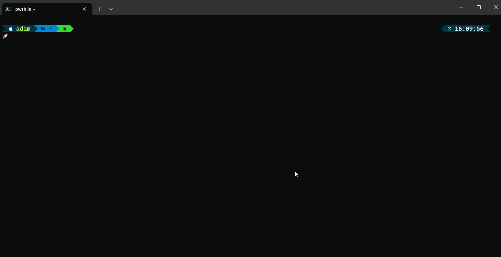

# hub-bub

 

## hub-bub

A simple little cli tool for quickly browsing github repository configuration.

 

---

## Installation
1. Install the [GitHub CLI](https://cli.github.com/)
1. Login to the GitHub CLI with `gh auth login`
1. Grab the latest release binary from the [releases page](https://github.com/admcpr/hub-bub/releases) and drop it somewhere in your path.

Built using [bubbletea](https://github.com/charmbracelet/bubbletea).
